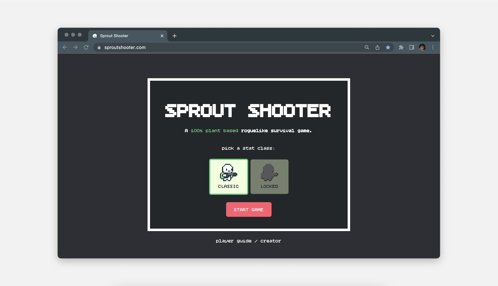

# 🌱 SPROUT SHOOTER
[**Sprout Shooter**](https://sproutshooter.com) is a roguelike survival shooter by [**Nicolas Prothero**](https://nicolasprothero.com) created entirely in HTML and JavaScript


## 🕹 CONTROLS 

**Sprout Shooter** requires to be played on a browser using a **keyboard**. 


### Movement

`W` is used to move the player **UP**

`A` is used to move the player **LEFT**

`S` is used to move the player **DOWN**

`D` is used to move the player **RIGHT**

<br>

### Shooting

`ARROW_UP` is used to shoot **UP**

`ARROW_LEFT` is used to shoot **LEFT**

`ARROW_DOWN` is used to shoot **DOWN**

`ARROW_RIGHT` is used to shoot **RIGHT**

<br>

### Menu

`i` is used to toggle Stat menu on the left.

`m` is used to cycle between audio settings:

- Press `one` time for **Background Music muted**

- Press `two` times for **all Audio muted**

- Press `three` times for **all Audio on**

<br>

## 🧩 FEATURES

### Player Stats
The player has many stats that include:

- **Health** (Visible by Hearts at the top left of screen)
- **Movement Speed**
- **Pellet Damage**
- **Firerate** (measured with bps *bullets per second*)
- **Pellet Speed**
- **Pellet Size** (Scales with Damage)

These stats can become **visible** by clickng `i`.

They can also be changed based on the **items** collected after certain waves. <sub>*to be implemented*</sub>

<br>

### Wave System
As the game progresses you will complete **"waves"** with each new wave being harder than the last.

Wave difficulty is determined through the amount of enemies per wave, an enemy's health, and the time between enemy spawning.

<br>

### Sharing System
Once done with your game you have the option to share your score with friends!

Press the `SHARE` button and your game information is automatically saved to your clipboard.

The **copied text** would look like this:

```
🌱 Sprout Shooter 
Wave: 2
Score: 3100 
https://sproutshooter.com
```
